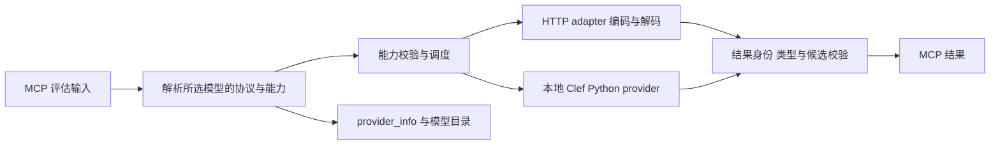

# 协议适配架构

供应商连接、模型能力和请求协议分别解析。同一供应商下，Tev1 使用 Chat Completions，Perplexity Decider 使用原生 Decisions；目录中的 decisions 标签不能决定协议或输入限制。

## 职责与调用链



| 边界                  | 职责                                             |
| --------------------- | ------------------------------------------------ |
| MCP / DecisionService | 评估输入、调度、批量隔离、结果身份与判断类型校验 |
| DecisionProvider      | 连接或本地运行时、认证、模型解析与目录、资源关闭 |
| DecisionAdapter       | 单次 HTTP 请求的路径、正文、协议校验与响应映射   |
| ModelProfile          | 精确 provider/model 的协议、状态及已知能力       |

`describe(model?)`、模型目录和执行共用解析结果。未登记型号为 `unverified`，默认拒绝执行；单次 `allowUnverifiedModel: true` 或宿主 `JEVS_ALLOW_UNVERIFIED_MODELS=true` 可显式尝试协议基线。`unsupported` 和能力限制始终拒绝。`provider_info.toolSupport` 描述五个评估工具的适用状态，工具发现保留全集以支持单次型号覆盖。

成功结果保留适配器 `protocol` 与上游实际 `model`。显式响应协议必须与模型声明一致；省略时由声明补充。概率、置信度、分数和用量不重算，缺失字段不造值，refusal 不转为负面答案。完整输入输出见 [MCP 契约](protocol.md)，部署配置见 [供应商接入](providers.md)。

## 扩展入口

内置 HTTP 协议为 `system-one`、`openai-decisions`、`openrouter-decisions`、`cloudflare-clef`、`cloudflare-gateway-system-one`、`tev1-chat`。已有协议部署到其他地址可使用 `custom` provider，显式设置协议、基础地址和模型；配置目录不宣称实时发现。

新同步 JSON HTTP 协议实现 [DecisionAdapter](../src/decision.ts)，由可信宿主代码注入：

```ts
const provider = createProvider(
  {
    kind: "custom",
    baseURL: "http://localhost:8080",
    defaultModel: "local/decision",
    protocol: adapter.id,
  },
  {
    adapters: [adapter],
    models: [
      {
        provider: "custom",
        model: "local/decision",
        protocol: adapter.id,
        availability: "unverified",
      },
    ],
  },
);
const server = createServer(provider);
// 未核实型号的评估须显式传 allowUnverifiedModel: true。
```

`capabilities(context)` 描述判断、模态和限制；`prepare(input, context)` 返回 `{path, body, decode}`。路径只能追加到配置 API 前缀，不允许切换主机。适配器不负责凭据、调度、重试或自动拆题。注入代码须受宿主信任，不能由工具输入或环境配置动态加载。

非 HTTP 接入实现 `DecisionProvider`。现有 `clef-python` 绑定宿主配置的解释器、官方模型目录和单一 selector，将内嵌图片与视频帧转换为 PIL 对象，再调用官方 loader/systemone；工具输入不能更换代码或模型目录。服务关闭时调用 provider 的可选 `close()`，回收运行时资源。

OpenAI 的有序 user 图文消息、图片 detail、等级标签、安全标识与按题 refusal 均有明确公共字段和能力声明。Clef 的 `mediaOptions` 仅映射官方媒体处理 kwargs；没有通用聊天、任意角色或 raw 请求透传。新判断语义需要相应公共契约；新格式、认证或运行时在所属边界适配。

## 本地验证

按 [开发环境](../README.md#开发与验证) 准备 Bun、Python 与测试用 Pillow，再运行 `PATH="$PWD/.local/test-python/bin:$PATH" bun run verify`。其中三个实验通过真实 MCP stdio 子进程覆盖接入链：

| 脚本                                                                        | 覆盖范围                                                                         |
| --------------------------------------------------------------------------- | -------------------------------------------------------------------------------- |
| [adapter-experiment.ts](../scripts/adapter-experiment.ts)                   | 原生/Tev1 模型解析、能力拒绝、异常回复、批量隔离、宿主注入独立布尔协议           |
| [openai-decisions-experiment.ts](../scripts/openai-decisions-experiment.ts) | typed choice、refusal、消息次序、图片 detail、等级标签、安全标识、目录交集与错误 |
| [clef-python-experiment.ts](../scripts/clef-python-experiment.ts)           | Python 进程、Pillow 媒体转换、worker 复用、错误恢复、批量隔离与关闭              |

实验可单独运行，例如 `bun --no-env-file scripts/openai-decisions-experiment.ts --entry dist/index.js`。报告默认写入 `.local/`，可用 `--output <path>` 指定位置；保留源码/入口摘要、HEAD 和场景结果，不记录凭据。场景数及请求数以该次报告为准。

HTTP 实验使用 loopback fixture，Python 实验使用合成后端，不加载真实权重或执行 GPU 推理。它们验证进程、协议与 MCP 边界，不证明真实账户访问、模型质量、费用或速度。
